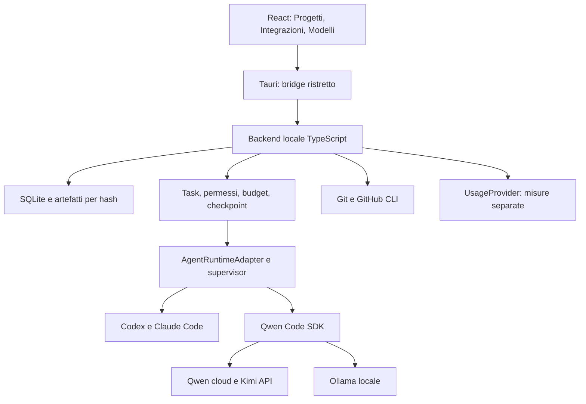

# Architettura e contratti

**Stato:** progetto da implementare · **Aggiornamento:** 28 settembre 2026.

## Responsabilità

Lagoto è il coordinatore locale dello stato del lavoro. Gli harness gestiscono inferenza e strumenti; Lagoto possiede task, autorizzazioni applicabili, registro dei consumi, checkpoint, verifiche e passaggi. La [decisione ADR 0001](adr/0001-runtime-and-adapters.md) sceglie adapter nativi Codex/Claude Code e Qwen Code SDK per cloud API e locale.

Il diagramma rappresenta componenti pianificati. Le frecce verso servizi cloud non implicano un backend cloud di Lagoto.

| Livello | Scelta | Vincolo |
| --- | --- | --- |
| Desktop | Tauri 2, Rust per lifecycle/IPC/OS | Packaging e confini del bridge provati in P00–P01 |
| UI | React, TypeScript, Vite | Nessun accesso diretto a shell o credenziali |
| Backend | Node.js incluso come sidecar, TypeScript | Versione compatibile con SDK e packaging, fissata in P00 |
| Contratti | Tipi condivisi e validazione Zod | Eventi originali conservati accanto alla normalizzazione |
| Dati | SQLite; Prisma candidato da provare | Singolo writer DB, migrazioni, backup consistente |
| Artefatti | Blob locali per hash, manifest versionati | Byte recuperabili; redazione ed esclusioni esplicite |
| Processi | Supervisor, stdio strutturato | Identità di processo oltre il solo PID; figli osservabili |
| Verifiche | Vitest; percorso UI nativo da provare | WebdriverIO/Tauri candidato; smoke macOS quando necessari |

Tauri documenta sidecar, Node e sicurezza; il percorso nativo di test e Prisma nel pacchetto sono ipotesi da convalidare, non capability già dimostrate. Vedi [fonti Tauri e Git](sources.md#desktop-e-git).

Nessun server HTTP di Lagoto in ascolto nel percorso iniziale. Ollama rimane un servizio separato. Nessun account Lagoto, cloud sync, Redis, vector database o framework di orchestration obbligatorio nell’MVP.

## Contratti minimi

Questi nomi definiscono responsabilità e dati, non API già esistenti.

| Contratto | Dati e compiti | Non deve possedere |
| --- | --- | --- |
| `IntegrationProfile` | ID, servizio/account opaco, auth mode, endpoint/regione, riferimento al segreto, piano, rinnovo, origine/versione dei dati | Token in chiaro, storico del task |
| `ModelProfile` | ID risolto, integrazione, runtime/versione, cloud/locale, capacità osservate, finestra, tokenizer/quantizzazione se noti, modelli abilitati | Una copia autonoma del saldo condiviso |
| `AgentRuntimeAdapter` | Discover, stato auth, start/send, eventi, permessi, interrupt, close e resume se supportato | La verità persistente del task o una quota inventata |
| `UsageProvider` | Lettura delle misure documentate, scope, unità, finestre, sorgente, timestamp, freschezza, capacità di riconciliazione | Politica di spesa o scelta autonoma del modello |
| `QuotaPool` | Identità del plafond per account/prodotto/metrica/finestra, modelli membri, saldo/limite osservabile, reset e vincoli applicabili | Somma di valute, token o account non equivalenti |
| `BudgetPolicy` | Pool principale, tipo numerico/stimato, ciclo, riserva, timezone, soglie, baseline, limiti e deroghe | Autorizzazione implicita a comprare crediti o cambiare account |
| `DailyAllowance` | Pool, data e segmento di ciclo, versione policy, saldo all’apertura, giorni residui, assegnazione congelata, consumo e prenotazioni | Nuovo budget per ogni modello/run che usa lo stesso pool |

Le relazioni sono esplicite: un’integrazione può abilitare più modelli; un modello può ricadere in più limiti. Un budget principale determina la batteria della scheda; gli altri limiti possono impedirne l’uso. [Calcolo e riconciliazione](daily-battery.md).

## Stato persistente

| Entità | Responsabilità |
| --- | --- |
| `Project`, `Repository` | Progetto, percorso canonico, identità Git/GitHub, disponibilità e ruoli |
| `Task`, `TaskRepository` | Obiettivo, repo selezionati, criteri, piano, worktree/branch/base per repository |
| `Run` | Profilo risolto, sessione nativa, permessi, stato, run precedente e versione adapter |
| `RunEvent` | Evento osservato, sequenza locale, ID sorgente/idempotenza, payload redatto |
| `Checkpoint`, `ContextPack` | Manifest recuperabile e pacchetto effettivamente consegnato al destinatario |
| `MemoryItem`, `Decision` | Contenuto atomico, origine, scope, revisione, validità, sostituzioni e trigger |
| `Verification`, `AcceptanceCriterion` | Prova, comando/esito, fingerprint e requisito cui si riferisce |
| `UsageObservation`, `UsageLedgerEntry`, `UsageReservation` | Misure, addebiti/rettifiche e impegni in corso senza doppio conteggio |
| `Approval`, `ExternalAction` | Scope delle autorizzazioni e intenzione/esito degli effetti esterni |
| `GitHubLinkOperation` | Intento durevole e avanzamento di creazione/collegamento/primo push |

Un evento dell’agente che dichiara successo non vale come prova di test, azione remota o task completato. Ogni fatto è osservato, dichiarato dall’agente, confermato dall’utente oppure ipotesi. Una correzione conserva lo storico, sostituisce lo stato vigente e invalida il contesto interessato.

Le misure distinguono `reported`, `estimated`, `manual`, `unavailable`, `stale`; includono unità, scope account/run, finestra e timestamp. Il valore assente non è zero. Token cumulativi fatturati, occupazione attuale del contesto e quota account non sono intercambiabili.

## Confini di controllo

1. Il renderer invia solo comandi tipizzati e allowlistati per progetto/task. CSP, rendering senza HTML attivo, URL filtrati e redazione proteggono il bridge.
2. Gli adapter ricevono soltanto credenziali e directory necessarie. Il backend avvia processi con ambiente filtrato e configurazione dedicata; non eredita indiscriminatamente segreti o impostazioni globali.
3. Le capability dichiarano ciò che è applicabile davvero: permessi, accesso multi-root, stop dei figli, hook di contesto, limiti per richiesta, uso offline. Un prompt “Plan” non costituisce un vincolo tecnico di sola lettura.
4. Un lock applicativo consente un solo writer per insieme di worktree. Non impedisce scritture di editor esterni. Il fencing scarta vecchi eventi, ma non ferma un CLI che scrive sul filesystem.
5. Gli effetti esterni hanno un registro separato: intenzione prima dell’avvio, esito confermato o incerto dopo. Nessun replay cieco se il risultato manca.
6. Il budget viene prenotato atomicamente prima dell’avvio. Se l’harness non permette un tetto per ogni richiesta, il budget è un controllo all’avvio/stop e una stima; non una garanzia di costo massimo della run.

Le capability Tauri non rendono automaticamente sicuri tutti i processi figli. Hook Git, MCP e script di repository sono esecuzioni da valutare al proprio confine. I contenuti di repo e log sono dati non fidati anche quando inseriti in memoria o riassunti. [Memoria e handoff](memory-handoff.md).

## Lifecycle e affidabilità

Un solo backend scrive sul database. Gli eventi durevoli precedono gli indicatori di salvataggio in UI. Frame incompleti, duplicati e fuori ordine non possono duplicare run, costi o tool. Backpressure, limiti di dimensione e riferimenti agli output completi evitano di saturare la UI.

Nascondere la finestra e uscire dall’app sono azioni diverse. Per uscire con una run attiva si espone lo stop sicuro; sleep e crash richiedono riconciliazione al ritorno. Non si promette esecuzione mentre il Mac è spento. Spazio insufficiente impedisce nuovi checkpoint completi e richiede gestione esplicita; retention e backup non eliminano l’ultima copia recuperabile né worktree sporchi.

Accettazione: P00 packaging/capability, P01 bridge/storage, P04 isolamento, P05 journal/consumi, P07–P08 recupero, P12 regressioni e affidabilità. Le [evidenze](evidence/README.md) devono distinguere CI deterministica e smoke reali.
